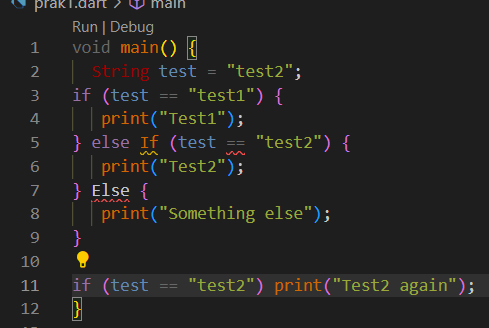
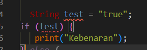
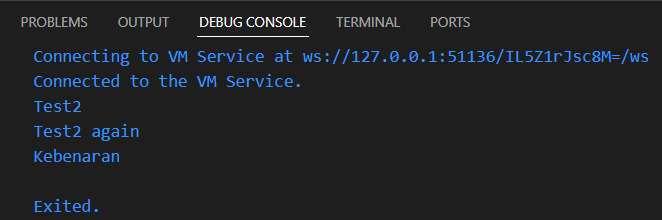
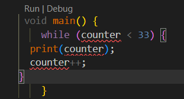
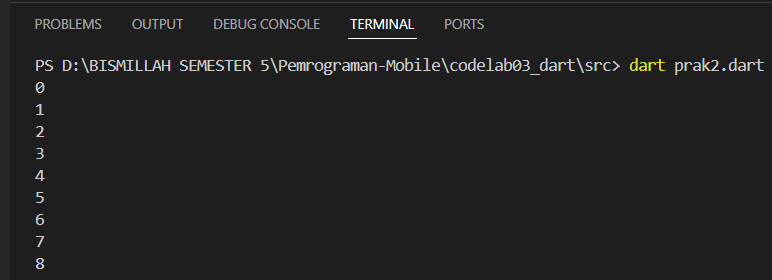
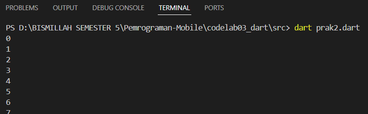
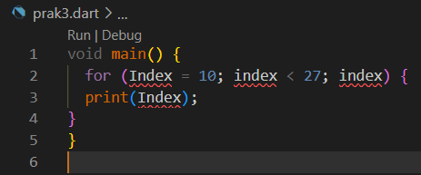
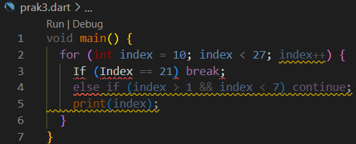
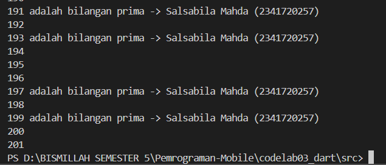

# A. PRAKTIKUM 1
    1. Langkah 1
        String test = "test2";
        if (test == "test1") {
        print("Test1");
        } else If (test == "test2") {
        print("Test2");
        } Else {
        print("Something else");
        }

        if (test == "test2") print("Test2 again");

    2. Langkah 2
        
        Terjadi error, karena kata kunci if, else if, dan else harus lowercase. Jadi If dan Else dianggap error. 

    3. Langkah 3
        
        Terjadi error karena kondifi if harus berupa boolean, bukan string. 
        Perbaikan Kode :
        void main() {
        String test = "test2";

        if (test == "test1") {
            print("Test1");
        } else if (test == "test2") {
            print("Test2");
        } else {
            print("Something else");
        }

        if (test == "test2") print("Test2 again");

        String status = "true";
        if (status == "true") {
            print("Kebenaran");
        } else {
            print("Bukan kebenaran");
        }
        }

          

# B. PRAKTIKUM 2
    1. Langkah 1
    while (counter < 33) {
    print(counter);
    counter++;
    }

    2. Langkah 2
    
    Terjadi error, karena variable counter belum pernah dideklarasikan sebelum dipakai. 
    Perbaikan Kode : 
    void main() {
    int counter = 0;

    while (counter < 33) {
        print(counter);
        counter++;
    }
    }

    

    3. Langkah 3
    
    Program mencetak angka 0-32 dengan while, lalu melanjutkan cetak 33-76 dengan do-while sebelum berhenti saat counter = 77. 

# C. PRAKTIKUM 3
    1. Langkah 1
        for (Index = 10; index < 27; index) {
        print(Index);
        }

    2. Langkah 2
        
        Terjadi Error karena variabel Index/index belum dideklarasikan dan penamaan tidak konsisten, serta bagian increment pada for salah, seharusnya index++.
        Perbaikan Kode : 
        void main() {
        for (int index = 10; index < 27; index++) {
            print(index);
        }
        }

    3. Langkah 3
        
        Terjadi error karena keyword ditulis dengan huruf besar (If, Else If) dan variabel tidak konsisten (index vs Index), sehingga Dart tidak mengenali keduanya. 
        Perbaikan Kode : 
        void main() {
        for (int index = 10; index < 27; index++) {
            if (index == 21) break;
            else if (index > 1 && index < 7) continue;
            print(index);
        }
        }

# D. TUGAS PRAKTIKUM
    Kode Program :
    void main() {
    String nama = "Salsabila Mahda";
    String nim = "2341720257";  

    for (int i = 0; i <= 201; i++) {
        if (isPrima(i)) {
        print("$i adalah bilangan prima -> $nama ($nim)");
        } else {
        print(i);
        }
    }
    }

    bool isPrima(int n) {
    if (n < 2) return false; 
    for (int i = 2; i * i <= n; i++) {
        if (n % i == 0) return false;
    }
    return true;
    }

    Output : 
    